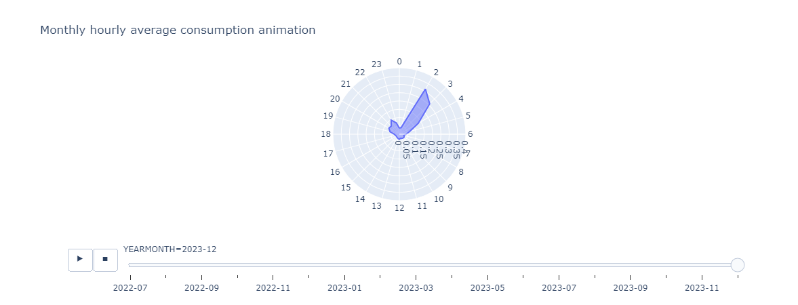

# Electricity Consumption Analysis: Evaluating Habit Changes

This Python project entails the visualization and analysis of electricity consumption data to determine the efficacy of habit changes on energy usage. Through data visualization techniques, the project assesses whether alterations in daily habits have led to a positive impact on electricity consumption. By examining trends, patterns, and correlations in the data, the project aims to provide insights into the effectiveness of behavioral adjustments in reducing energy consumption.

Below is a snippet of an animation produced in plotly that can be visualized in this [link](https://htmlpreview.github.io/?https://github.com/pedrodamas1/Electricity-Consumption-Analysis/blob/main/PROCESS/animation.html).



The Python libraries leveraged in this project included:

```python
import plotly
import scipy
import pandas as pd
import numpy as np
import matplotlib.pyplot as plt
import seaborn as sns
```
